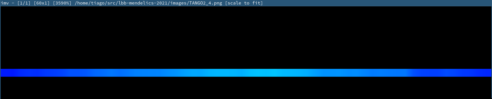
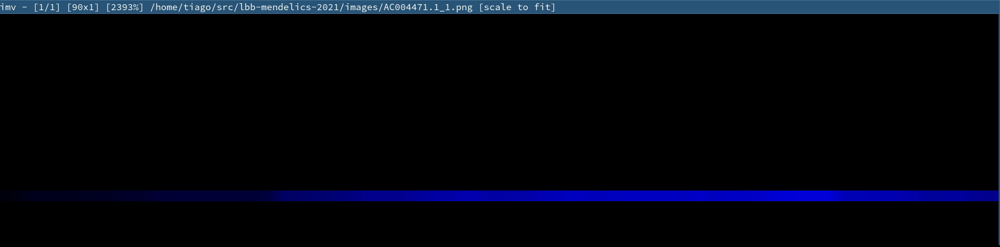

# Solução do desafio Mendelics da LBB [(link)](https://github.com/mendelics/lbb-mendelics-2021/blob/main/Dia_2/README.md)

As tarefas foram implementadas em Bash e C++. As mesmas dependências da [tarefa 1](../README.md) são usadas, com adição de [sambamba](https://lomereiter.github.io/sambamba/index.html) para filtragem de arquivos BAM, e clang para compilar C++.

## Tarefa

> Quais variantes deverão ser desconsideradas no seu VCF? - Qualquer métrica do software de escolha poderá ser utilizada. Discorra sobre a métrica utilizada.

O pipeline pode ser visto em [clean-run.sh](clean-run.sh).

Eu mantive os mesmos *scores* padrões do bowtie2, que já são robustos o suficiente. O parâmetro `--very-sensitive` foi adicionado ao bowtie2 para realizar mais buscas e possivelmente encontrar mais regiões similares, o que nos dá maior confiança no valor de qualidade do mapeamento (MAPQ) gerado. O parâmetro `--no-unal` também foi adicionado para não colocar na saída segmentos que não tenham alinhado, o que gera um arquivo um pouco menor e sem entradas que não utilizaríamos.

Algumas etapas de filtragem foram adicionadas. Primeiramente, segmentos onde o bowtie2 encontrou outro alinhamento com bom *score* no genoma de referência foram descartados. Isso foi feito removendo todos os segmentos que tivessem a tag XS (essa tag é colocada pelo bowtie2 apenas se o segmento possui outro alinhamento bom, e seu valor é o *score* do segundo melhor alinhamento). Segmentos com MAPQ < 20 também foram removidos.

Após essas etapas de filtragem, o BAM reduziu de 48M (1714279 segmentos) para 40M (1444854 segmentos). Os BAMs estão inclusos na mesma pasta desse README.md.

O VCF filtrado possui 3746 variantes, em contraste com 4024 antes da filtragem. Se delimitarmos para as regiões de captura do kit, o VCF possui 711 entradas. Os dois VCFs estão disponíveis em [amostra-lbb-day2.vcf.gz](amostra-lbb-day2.vcf.gz) (VCF filtrado) e [amostra-lbb-day2-capture-regions.vcf.gz](amostra-lbb-day2-capture-regions.vcf.gz) (VCF filtrado e delimitado para as regiões de captura dadas no enunciado).

> Discorra sobre as regiões com baixa cobertura e quais foram seus critérios. Figuras são bem-vindas.

O programa coverage.cpp calcula a cobertura para cada posição no genoma e gera um BED com o resultado. Além disso, para cada região de captura do kit, ele calcula a cobertura máxima e mínima que há naquela região, e gera uma imagem para visualização da cobertura na região. O BED com todas as regiões não cobertas está em [uncovered.bed](./uncovered.bed)

Observei que 190 das regiões de captura do kit não estão cobertas, e mais algumas estão parcialmente cobertas (possuem posições com cobertura 0), o que indica que a minha filtragem foi excessiva, ou meus parâmetros de mapeamento devem ser ajustados, ou a amostra não cobriu essas regiões.

A cobertura em cada região está na pasta [images](../images). Cada pixel na imagem é escuro se não tiver cobertura, e se torna mais colorido quanto maior a cobertura. Por exemplo, na região `TANGO2_4`, que possui boa cobertura:



E na `AC004471.1_1`, que não está muito coberta no início:



Informações das regiões de captura (posição com menor e menor cobertura para cada região) estão em [coverage.txt](coverage.txt).

> Obter informações sobre seu alinhamento. Quantos reads? Qual a porcentagem deles que foi mapeada corretamente? Muitos alinharam em mais de um local do genoma com a mesma qualidade? Deverá ser enviado um arquivo TSV, com as colunas "nreads" (número de reads usados), `proper_pairs` (pares mapeados corretamente), `mapQ_0` (número de reads com qualidade de mapeamento == 0)

Informações como `proper_pairs` têm uma definição e cálculo um pouco diferentes dependendo da ferramenta usada. Utilizei `samtools flagstat` para calcular para o meu alinhamento. Entradas com `mapQ == 0` foram removidas pelo meu filtro, então suponho que essa parte do enunciado deva ser feita sobre o alinhamento bruto, antes da filtragem, o que incluirá entradas com mapQ ruim ou mapeamento não único.

```
$ samtools flagstat mapped_day2.bam
1714279 + 0 in total (QC-passed reads + QC-failed reads)
1714279 + 0 primary
0 + 0 secondary
0 + 0 supplementary
0 + 0 duplicates
0 + 0 primary duplicates
1714279 + 0 mapped (100.00% : N/A)
1714279 + 0 primary mapped (100.00% : N/A)
1714279 + 0 paired in sequencing
857810 + 0 read1
856469 + 0 read2
1656086 + 0 properly paired (96.61% : N/A)
1708180 + 0 with itself and mate mapped
6099 + 0 singletons (0.36% : N/A)
0 + 0 with mate mapped to a different chr
0 + 0 with mate mapped to a different chr (mapQ>=5)
$ samtools view mapped_day2.bam | awk '{print $5}' | grep -c '^0$'
16527
```

O resultado são nreads == 1714279, proper_pairs == 1656086 e mapQ == 16527. Nos dados filtrados, os resultados seriam:

```
$ samtools flagstat filtered_day2.bam
1444854 + 0 in total (QC-passed reads + QC-failed reads)
1444854 + 0 primary
0 + 0 secondary
0 + 0 supplementary
0 + 0 duplicates
0 + 0 primary duplicates
1444854 + 0 mapped (100.00% : N/A)
1444854 + 0 primary mapped (100.00% : N/A)
1444854 + 0 paired in sequencing
723186 + 0 read1
721668 + 0 read2
1413985 + 0 properly paired (97.86% : N/A)
1441053 + 0 with itself and mate mapped
3801 + 0 singletons (0.26% : N/A)
0 + 0 with mate mapped to a different chr
0 + 0 with mate mapped to a different chr (mapQ>=5)
$ samtools view filtered_day2.bam | awk '{print $5}' | grep -c '^0$'
0
```

Os TSVs [bruto.tsv](bruto.tsv) e [filtrado.tsv](filtrado.tsv) foram gerados desses dados.
